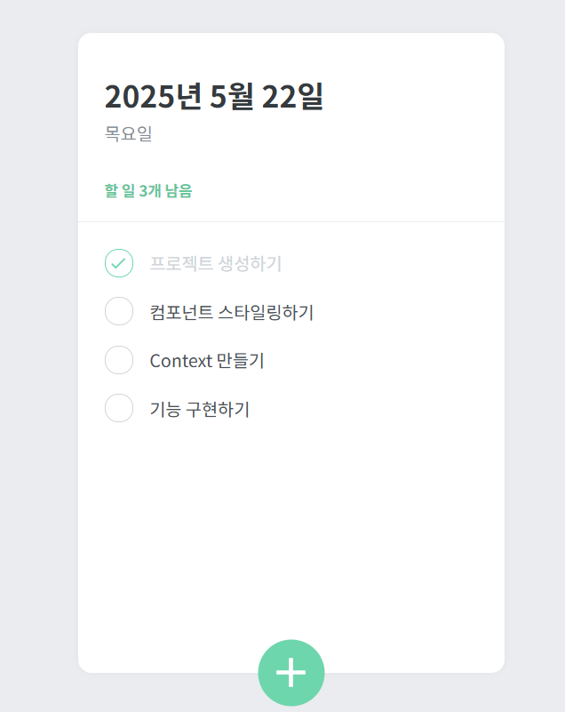
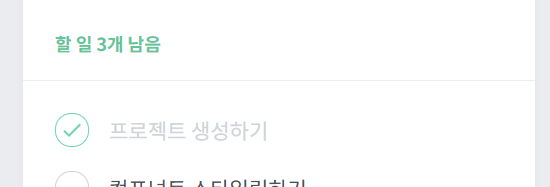
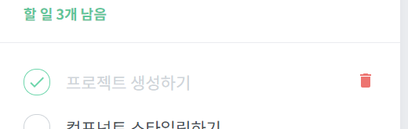
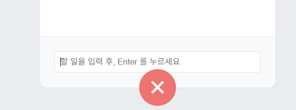
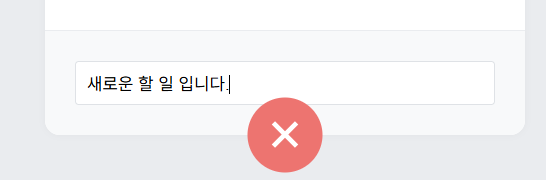
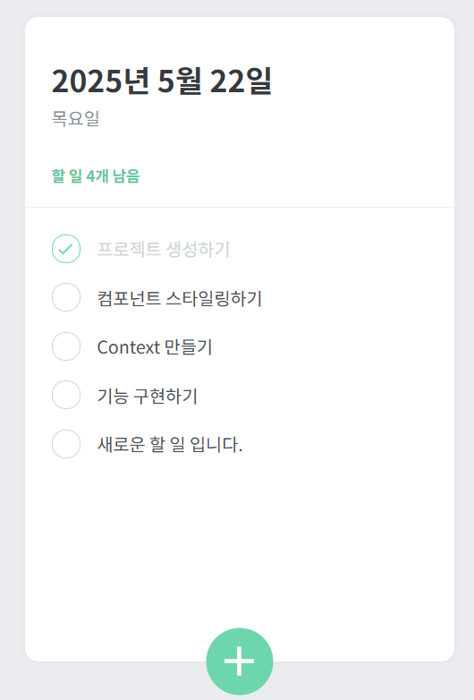

# TODO list 만들기

- 할 일을 관리할 수 있는 TODOlist 홈페이지를 구현합니다.

## 페이지 안내

- 총 5가지의 컴포넌트를 사용합니다.
   - TodoTemplate : 투두리스트의 레이아웃을 설정하는 컴포넌트
   - TodoHead : 오늘의 날짜와 요일을 보여주고, 앞으로 해야 할 일을 보여주는 컴포넌트
   - TodoList : Todoitem 컴포넌트를 렌더링해주는 컴포넌트
   - Todoitem : 각 일에 대한 정보를 렌더링해주는 컴포넌트
   - TodoCreate : 새로운 할 일을 등록할 수 있게 해주는 컴포넌트

 - 

## 구성요소

- App.js
- index.js
- TodoTemplate.jsx / TodoHead.jsx / TodoList.jsx / Todoitem.jsx / TodoCreate.jsx
- TodoContext.js

<br/>
<br/>
<br/>

## 소스코드 info.

### TodoCreate.jsx

```jsx
import React, { useState } from 'react';
import styled, { css } from 'styled-components';
import { MdAdd } from 'react-icons/md';
import { useTodoDispatch, useTodoNextId } from '../TodoContext';

const CircleButton = styled.button`
  background: #38d9a9;
  &:hover {
    background: #63e6be;
  }
  &:active {
    background: #20c997;
  }

  z-index: 5;
  cursor: pointer;
  width: 80px;
  height: 80px;
  display: block;
  align-items: center;
  justify-content: center;
  font-size: 60px;
  position: absolute;
  left: 50%;
  bottom: 0px;
  transform: translate(-50%, 50%);
  color: white;
  border-radius: 50%;
  border: none;
  outline: none;
  display: flex;
  align-items: center;
  justify-content: center;

  transition: 0.125s all ease-in;
  ${props =>
    props.open &&
    css`
      background: #ff6b6b;
      &:hover {
        background: #ff8787;
      }
      &:active {
        background: #fa5252;
      }
      transform: translate(-50%, 50%) rotate(45deg);
    `}
`;

const InsertFormPositioner = styled.div`
  width: 100%;
  bottom: 0;
  left: 0;
  position: absolute;
`;

const InsertForm = styled.form`
  background: #f8f9fa;
  padding: 32px;
  border-bottom-left-radius: 16px;
  border-bottom-right-radius: 16px;
  border-top: 1px solid #e9ecef;
`;

const Input = styled.input`
  padding: 12px;
  border-radius: 4px;
  border: 1px solid #dee2e6;
  width: 100%;
  outline: none;
  font-size: 18px;
  box-sizing: border-box;
`;

function TodoCreate() {
  const [open, setOpen] = useState(false);
  const [value, setValue] = useState('');
  const dispatch = useTodoDispatch();
  const nextId = useTodoNextId();

  const onToggle = () => setOpen(!open);
  const onChange = e => setValue(e.target.value);
  const onSubmit = e => {
    e.preventDefault();
    dispatch({
      type: 'CREATE',
      todo: {
        id: nextId.current,
        text: value,
        done: false
      }
    });
    setValue('');
    setOpen(false);
    nextId.current += 1;
  };

  return (
    <>
      {open && (
        <InsertFormPositioner>
          <InsertForm onSubmit={onSubmit}>
            <Input
              autoFocus
              placeholder="할 일을 입력 후, Enter 를 누르세요"
              onChange={onChange}
              value={value}
            />
          </InsertForm>
        </InsertFormPositioner>
      )}
      <CircleButton onClick={onToggle} open={open}>
        <MdAdd />
      </CircleButton>
    </>
  );
}

export default React.memo(TodoCreate);

```
#### Explanation.

- 새로운 항목을 등록할 수 있는 컴포넌트
- react-icons의 MdAdd를 사용
- useState를 사용하여 토글할 수 있는 open 값을 관리, 해당 값이 true일 때 아이콘을 45도 회전 후 X모양이 보여지게 변경(색상 빨간 색으로 변경)
- 할 일을 직접 사용자가 입력할 수 있는 폼 출력


### TodoHead.jsx

```jsx
import React from 'react';
import styled from 'styled-components';
import { useTodoState } from '../TodoContext';

const TodoHeadBlock = styled.div`
  padding: 48px 32px 24px;
  border-bottom: 1px solid #e9ecef;
  h1 {
    margin: 0;
    font-size: 36px;
    color: #343a40;
  }
  .day {
    margin-top: 4px;
    color: #868e96;
    font-size: 21px;
  }
  .tasks-left {
    color: #20c997;
    font-size: 18px;
    margin-top: 40px;
    font-weight: bold;
  }
`;

function TodoHead() {
  const todos = useTodoState();
  const undoneTasks = todos.filter(todo => !todo.done);
  const today = new Date();
  // 오늘의 날짜를 출력(한국 기준)
  const dateString = today.toLocaleDateString('ko-KR', {
    year: 'numeric',
    month: 'long',
    day: 'numeric'
  });
  const dayName = today.toLocaleDateString('ko-KR', { weekday: 'long' });

  return (
    <TodoHeadBlock>
      <h1>{dateString}</h1>
      <div className="day">{dayName}</div>
      <div className="tasks-left">할 일 {undoneTasks.length}개 남음</div>
    </TodoHeadBlock>
  );
}

export default TodoHead;

```
#### Explanation.

- 오늘의 날짜, 요일, 남은 할 일의 개수를 출력


### Todoitem.jsx

```jsx
import React from 'react';
import styled, { css } from 'styled-components';
import { MdDone, MdDelete } from 'react-icons/md';
import { useTodoDispatch } from '../TodoContext';

const Remove = styled.div`
  display: none;
  align-items: center;
  justify-content: center;
  color: #dee2e6;
  font-size: 24px;
  cursor: pointer;
  &:hover {
    color: #ff6b6b;
  }
`;

const TodoItemBlock = styled.div`
  display: flex;
  align-items: center;
  padding: 12px 0;
  &:hover {
    ${Remove} {
      display: initial;
    }
  }
`;

const CheckCircle = styled.div`
  width: 32px;
  height: 32px;
  border-radius: 16px;
  border: 1px solid #ced4da;
  font-size: 24px;
  display: flex;
  align-items: center;
  justify-content: center;
  margin-right: 20px;
  cursor: pointer;
  ${props =>
    props.done &&
    css`
      border-color: #38d9a9;
      color: #38d9a9;
    `}
`;

const Text = styled.div`
  flex: 1;
  font-size: 21px;
  color: #495057;
  ${props =>
    props.done &&
    css`
      color: #ced4da;
    `}
`;

function TodoItem({ id, done, text }) {
  const dispatch = useTodoDispatch();
  return (
    <TodoItemBlock>
      <CheckCircle done={done} onClick={() => dispatch({ type: 'TOGGLE', id })}>
        {done && <MdDone />}
      </CheckCircle>
      <Text done={done}>{text}</Text>
      <Remove onClick={() => dispatch({ type: 'REMOVE', id })}>
        <MdDelete />
      </Remove>
    </TodoItemBlock>
  );
}

export default React.memo(TodoItem);

```
#### Explanation.

- 각 할 일의 항목을 보여주는 TodoItem 컴포넌트를 제작(react-icons에서 MdDone과 MdDelete 아이콘 사용)
- Component Selector 기능 사용


### TodoList.jsx

```jsx
import React from 'react';
import styled from 'styled-components';
import TodoItem from './TodoItem';
import { useTodoState } from '../TodoContext';

const TodoListBlock = styled.div`
  flex: 1;
  padding: 20px 32px 48px;
  overflow-y: auto;
`;

function TodoList() {
  const todos = useTodoState();

  return (
    <TodoListBlock>
      {todos.map(todo => (
        <TodoItem key={todo.id} {...todo} />
      ))}
    </TodoListBlock>
  );
}

export default TodoList;

```
#### Explanation.

 - 여러 개의 할 일 항목을 보여주는 컴포넌트


### Todotemplate.jsx

```jsx
import React from 'react';
import styled from 'styled-components';

const TodoTemplateBlock = styled.div`
  width: 512px;
  height: 768px;
  position: relative;
  background: white;
  border-radius: 16px;
  box-shadow: 0 0 8px rgba(0, 0, 0, 0.04);
  margin: 96px auto 32px;  /*페이지 중앙에 출력력*/
  display: flex;
  flex-direction: column;
`;

function TodoTemplate({ children }) {
  return <TodoTemplateBlock>{children}</TodoTemplateBlock>;
}

export default TodoTemplate;

```
#### Explanation.

- 중앙에 정렬된 흰색 박스를 구성하는 요소


### TodoContext.js

```jsx
import React, {
  createContext,
  useReducer,
  useContext,
  useRef
} from 'react';

// 초기 할 일 목록
const initialTodos = [
  { id: 1, text: '프로젝트 생성하기', done: true },
  { id: 2, text: '컴포넌트 스타일링하기', done: true },
  { id: 3, text: 'Context 만들기', done: false },
  { id: 4, text: '기능 구현하기', done: false }
];

// 리듀서 함수
function todoReducer(state, action) {
  switch (action.type) {
    case 'CREATE':
      return state.concat(action.todo);
    case 'TOGGLE':
      return state.map(todo =>
        todo.id === action.id ? { ...todo, done: !todo.done } : todo
      );
    case 'REMOVE':
      return state.filter(todo => todo.id !== action.id);
    default:
      throw new Error(`Unhandled action type: ${action.type}`);
  }
}

// Context 생성
const TodoStateContext = createContext();
const TodoDispatchContext = createContext();
const TodoNextIdContext = createContext();

// Context Provider
export function TodoProvider({ children }) {
  const [state, dispatch] = useReducer(todoReducer, initialTodos);
  const nextId = useRef(5);

  return (
    <TodoStateContext.Provider value={state}>
      <TodoDispatchContext.Provider value={dispatch}>
        <TodoNextIdContext.Provider value={nextId}>
          {children}
        </TodoNextIdContext.Provider>
      </TodoDispatchContext.Provider>
    </TodoStateContext.Provider>
  );
}

// 커스텀 Hook
export function useTodoState() {
  const context = useContext(TodoStateContext);
  if (!context) throw new Error('Cannot find TodoProvider');
  return context;
}

export function useTodoDispatch() {
  const context = useContext(TodoDispatchContext);
  if (!context) throw new Error('Cannot find TodoProvider');
  return context;
}

export function useTodoNextId() {
  const context = useContext(TodoNextIdContext);
  if (!context) throw new Error('Cannot find TodoProvider');
  return context;
}

```
#### Explanation.

- useReducer를 사용하여 상태를 관리하는 TodoProvider 컴포넌트 사용

<br/>
<br/>
<br/>


## 출력결과

<b>(기본 렌더링 모습)</b>
<br></img>
<br/>
#### Explanation.
- 오늘의 시간과 요일이 출력되고 아래에 해야 할 일의 갯수와 목록이 출력
<br/>
<br/>

<b>(완료된 일 체크)</b>
<br>
</img>
<br/>
#### Explanation.
- 좌측의 원을 클릭하면, 체크표시 및 텍스트 색상의 흐림 처리
- 상단의 남아있는 할 일의 개수가 감소
<br/>
<br/>

<b>(할 일 삭제)</b>
<br>
</img>
<br/>
#### Explanation.
- 특정 할 일에 커서를 가져다 대면 우측에 휴지통 모양이 출력되고 휴지통을 클릭하면 할 일을 삭제
- 휴지통에 커서를 가져다 댔을 때 빨간 색상으로 변화
<br/>
<br/>

<b>(할 일 추가)</b>
<br>
<br></img>
<br></img>
</img>
<br/>
#### Explanation.
- 아래의 '+'버튼을 누르면 버튼이 회전하며 빨간 색상의 X로 변경되고, 추가 할 일을 입력받을 수 있는 입력란 생성
- 입력란에 할 일을 추가 후 Enter를 클릭하면 새로운 할 일 생성
