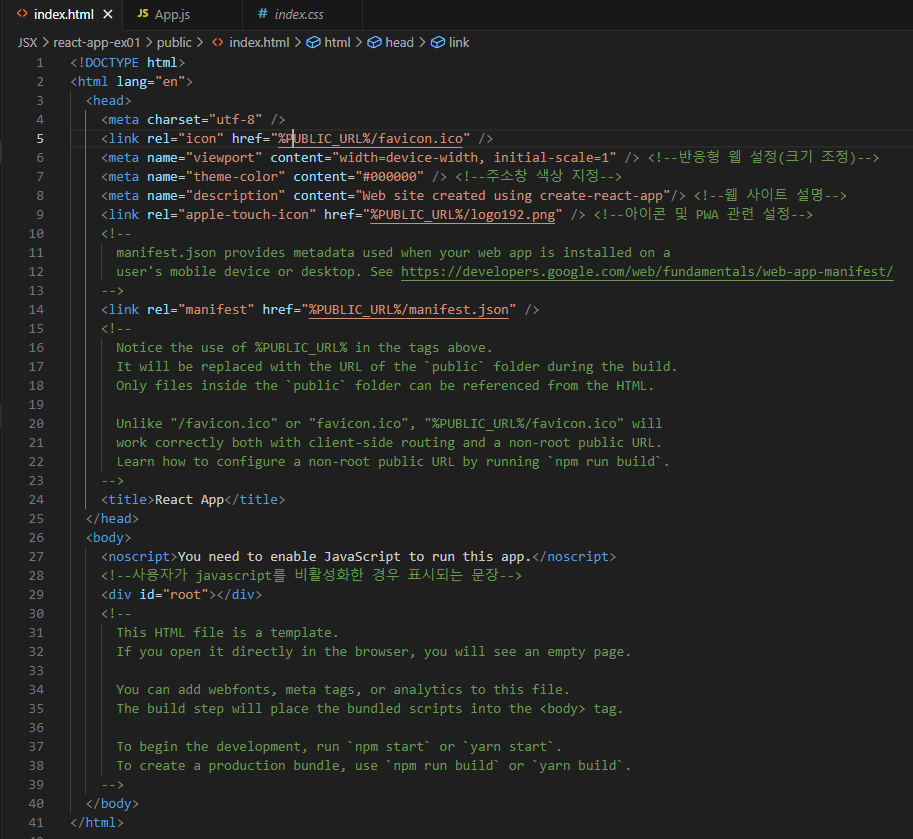
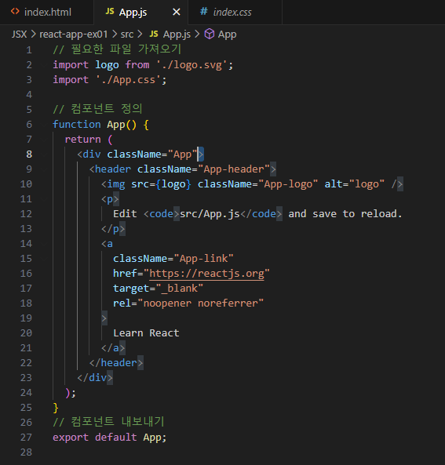
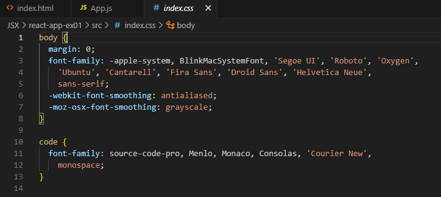
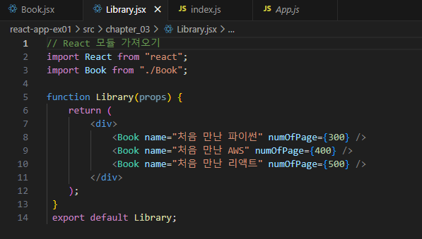
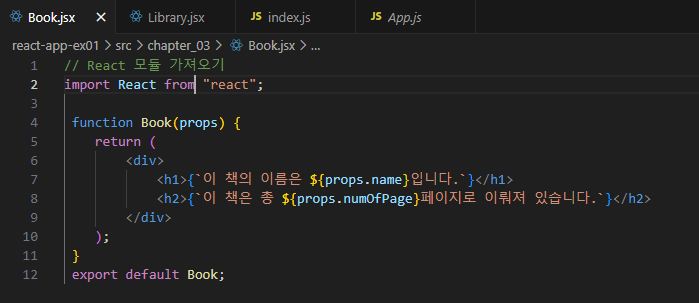

# JSX 실습내용

### - MPA(Multi-page app lifecycle)방식을 이용한 웹페이지 실습입니다.
 

 #### 안내사항
 
>    1. 해당 실습에 요구되는 파일의 수가 많아 핵심 파일인 App.js / index.html / index.js와 Book.jsx/Library.jsx 파일이 업로드 되어있습니다.
>    >
>    2. 각각의 소스코드 이미지와 출력되었을 때의 이미지를 포함하고 있습니다.

 #### 출력결과
 
>    1. 책의 이름과 해당 책의 구성 페이지에 대한 정보를 확인하실 수 있습니다.

 </img> 
 </img> 
 </img> 
 </img> 
 </img> 
 </img> 

