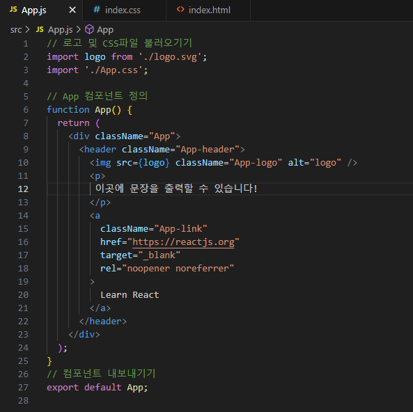
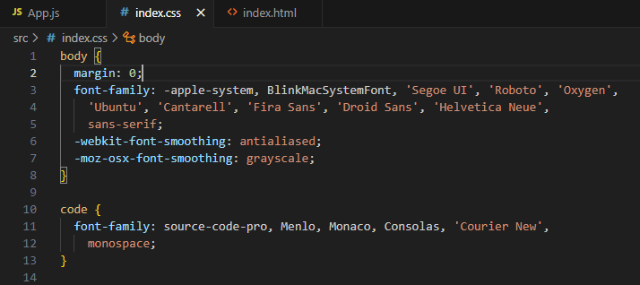
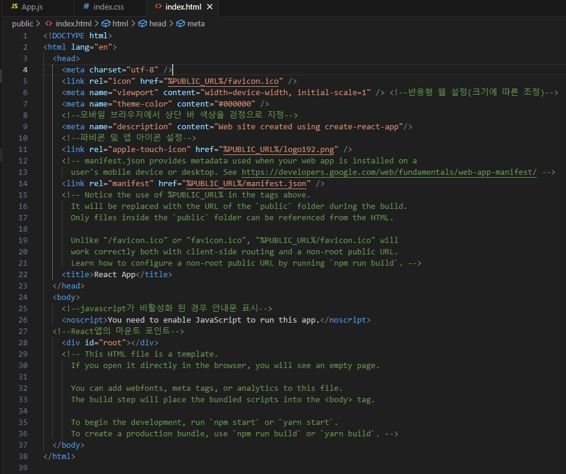
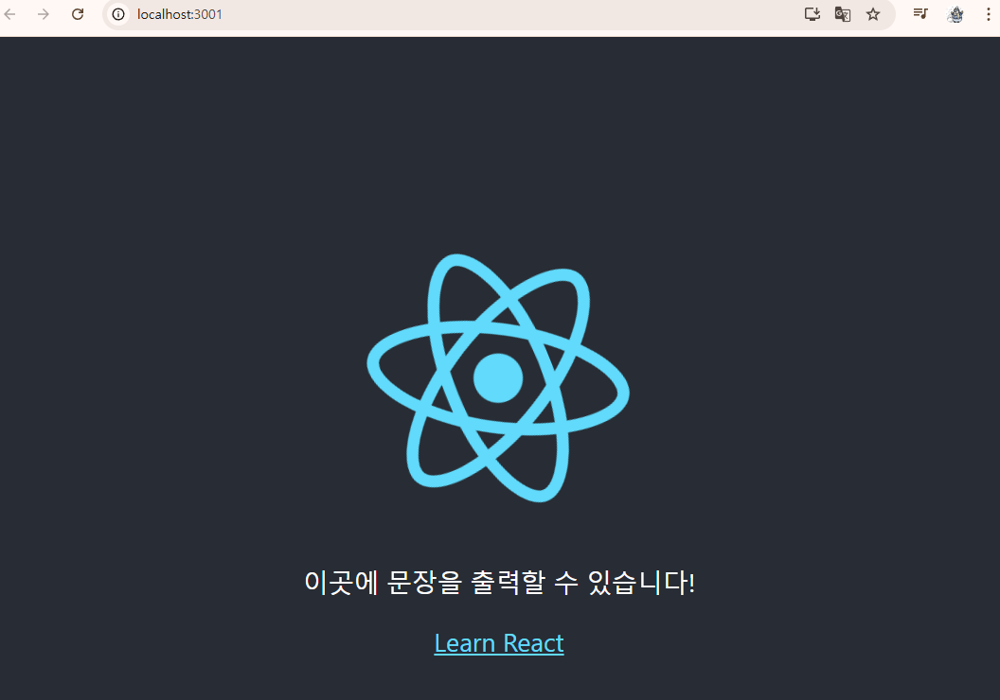

# React Project 실습내용

### - React를 활용한 프로젝트 생성 실습입니다.
 

 #### 안내사항
 
>    1. 해당 실습에 요구되는 파일의 수가 많아 핵심 파일인 App.js / index.html / index.js 파일이 업로드 되어있습니다.
>    >
>    2. 각각의 소스코드 이미지와 출력되었을 때의 이미지를 포함하고 있습니다.

 #### 출력결과
 
>    1. 정상적으로 index.html파일에서 수정한 문장을 포함한 React Project가 구동되는 것을 확인하실 수 있습니다.

 </img> 
 </img> 
 </img> 
 </img> 

