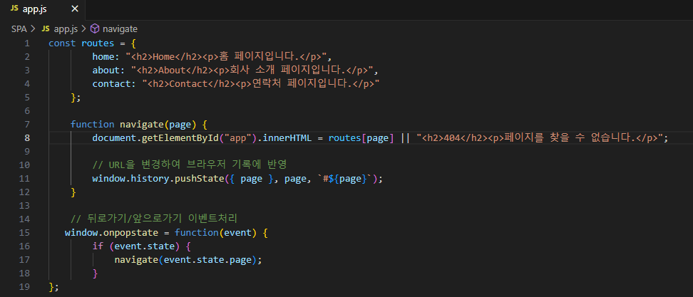
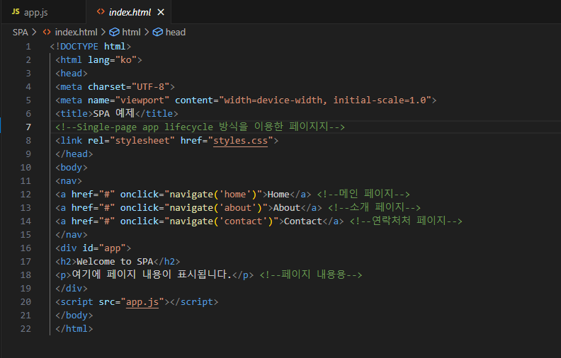
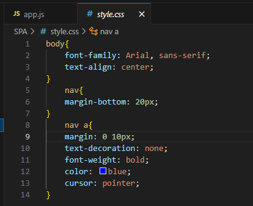
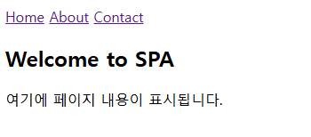

# SPA 실습내용

### - SPA(Single-page app lifecycle)방식을 이용한 웹페이지 실습입니다.
 

 #### 안내사항
 
>    1. 해당 파일은 app.js / index.html / style.css로 구성되어 있습니다.
>    >
>    2. 각각의 소스코드 이미지와 출력되었을 때의 이미지를 포함하고 있습니다.

 #### 출력결과
 
>    1. 'Home' 버튼을 통해 메인 페이지로 접속할 수 있습니다.
>    >
>    2. 'About' 버튼을 통해 소개 페이지로 접속할 수 있습니다.
>    >
>    3. 'Contact' 버튼을 통해 연락처 페이지로 접속할 수 있습니다.

 </img> 
 </img> 
 </img> 
 </img> 

