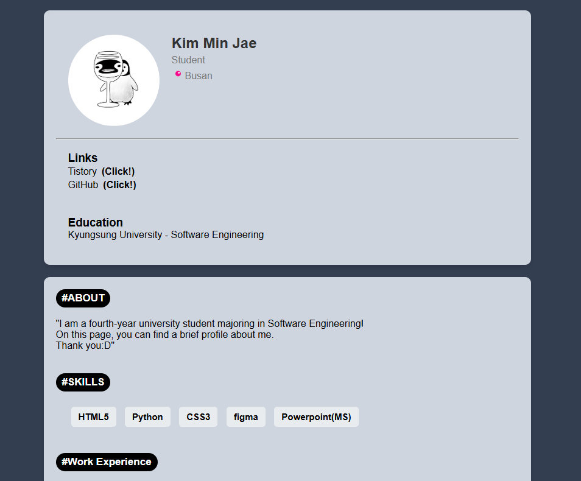
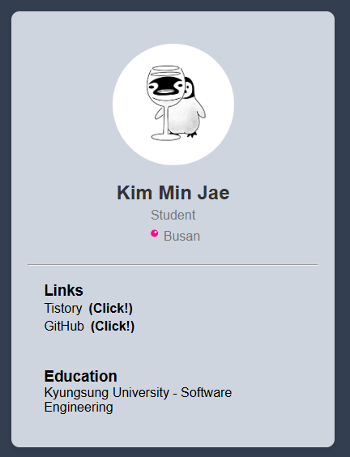

# 간단한 자기소개 웹페이지 만들기

이미지 파일이 포함된 간단한 자기소개 페이지를 생성합니다.


## 구성요소

- HTML5
- CSS


## 소스코드 info.

### index.html

```html
<!-- 첫 번째 컨테이너 -->
  <div class="container">
    <div class="profile">
      
      <div class="info">
        <h2>Kim Min Jae</h2>
        <p>Student</p>
        <p>📍Busan</p>
      </div>
    </div>
    <hr />
    <div class="works">
      <h3>Links</h3>
      <div id="contact">
        <a href="https://qmffjr2001.tistory.com" target="_blank">Tistory</a><b>(Click!)</b><br />
        <a href="https://github.com/WSIDFY" target="_blank">GitHub</a><b>(Click!)</b><br />
      </div>
    </div>
    <div class="works">
      <h3>Education</h3>
      <p>Kyungsung University - Software Engineering</p>
    </div>
  </div>
```
#### Explanation.


1. 포함되어있는 Class의 구성은 아래와 같습니다.

   - container
   - profile
   - info
   - works
   - contact
  
2. 해당 컨테이너 구역은 페이지 상단의 구역이며 아래의 내용이 포함되어 있습니다.

   - 프로필 이미지
   - 직업
   - 거주지
   - 링크
   - 학력사항

```html
<!-- 두 번째 컨테이너 -->
  <div class="container">
    <!-- ABOUT -->
    <h3 class="section-title">#ABOUT</h3><br><br>
    <p>
      "I am a fourth-year university student majoring in Software Engineering!<br />
      On this page, you can find a brief profile about me.<br />
      Thank you:D"
    </p>
    <br /><br />

    <!-- SKILLS -->
    <h3 class="section-title">#SKILLS</h3>
    <div class="skills">
      <span>HTML5</span>
      <span>Python</span>
      <span>CSS3</span>
      <span>figma</span>
      <span>Powerpoint(MS)</span>
    </div>
    <br />

    <!-- Work Experience -->
    <h3 class="section-title">#Work Experience</h3>
    <br /><br />
    <p><strong>Zeroweb (2024.09 - 2025.02)</strong></p>
    <span>Web/Mobile Website Planning and Maintenance</span>
    <br /><br /><br />

    <!-- Activity History -->
    <h3 class="section-title">#Activity History</h3>
    <br /><br />
    <p>
      <strong>(LG) - LG Aimers 4th (2023.08 - 2024.03)<br />
      (KITRI) - White Hat School 1st (2024.01 - 2024.02)</strong>
    </p>
```
#### Explanation.


1. 포함되어있는 Class의 구성은 아래와 같습니다.

   - container
   - section-title
   - skills
  
2. 해당 컨테이너 구역은 페이지 상단의 구역이며 아래의 내용이 포함되어 있습니다.

   - 간단한 자기소개 문구
   - 스킬
   - 경력
   - 활동 경력

### style.css

1. 구성요소는 아래와 같습니다.

     - 전체적용 요소(*)
     - body
     - container
     - profile
     - profile img
     - info
     - info h2
     - info p
     - contact a
     - contact a:hover
     - section-title
     - works, skills
     - skills span

1. 반응형 요소가 추가되어 있습니다.

```css
  @media (max-width: 600px) {
    .profile {
      flex-direction: column;
    }
    .info {
      text-align: center;
    }
     /* 이미지 중앙 정렬 */
  .profile img {
    display: block;
    margin: 0 auto;
  }
```
  
       
## 출력결과

<b>(웹 출력)</b>
<br></img><br/>

<br>

<b>(모바일 출력)</b>
<br></img><br/>
