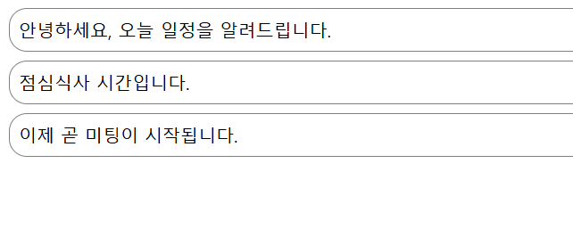

# Notification실습 /

- 미리 정의한 알림 메시지를 순차적으로 출력하고 정리합니다.

## 페이지 기능

- 1초 단위로 메시지 출력
- 3개의 메시지가 모두 출력되었을 때 타이머 정지

## 구성요소

- HTML5
- CSS
- jsx
- React


## 소스코드 info.

### Notification.jsx

```js
// 인라인 스타일 정의
const styles = {
    wrapper: {
        margin: 8,
        padding: 8,
        display: "flex",
        flexDirection: "row",
        border: "1px solid grey",
        borderRadius: 16,
    },
    messageText: {
        color: "black",
        fontSize: 16,
    },
};
```
#### Explanation.


1. 인라인 스타일을 정의합니다.
  

```js
class Notification extends React.Component {
    constructor(props) {
        super(props);
        // 초기 state 정의(확장시 활용 가능)
        this.state = {};
    }
    
    // 컴포넌트가 마운트된 직후 호출되는 라이프사이클 메서드
    componentDidMount() {
        console.log(`${this.props.id} componentDidMount() called.`);
    }

    // 컴포넌트가 업데이트된 후 호출되는 라이프사이클 메서드
    componentDidUpdate() {
        console.log(`${this.props.id} componentDidUpdate() called.`);
    }

    // 컴포넌트가 언마운트되기 직전에 호출되는 라이프사이클 메서드
    componentWillUnmount() {
        console.log(`${this.props.id} componentWillUnmount() called.`);
    }
```
#### Explanation.


1. 포함되어있는 라이프사이클 메서드의 구성은 아래와 같습니다.

   - componentDidMount : 컴포넌트가 마운트 된 직후 호출
   - componentDidUpdate : 컴포넌트가 업데이트된 후 호출되는 라이프사이클 메서드
   - componentWillUnmount : 컴포넌트가 언마운트 되기 전에 호출되는 라이프사이클 메서드

```js
 // 렌더링 함수: 컴포넌트의 UI를 정의하고 반환합니다.
    render() {
        return (
            <div style={styles.wrapper}>
                <span style={styles.messageText}>{this.props.message}</span>
            </div>
        );
```
#### Explanation.


1. 렌더링 함수이며 컴포넌트의 UI를 정의하고 반환합니다.


### NotificationList.jsx

```js
// 해당 배열에 정의된 알림들이 순차적으로 화면에 출력
const reservedNotifications = [
    {
        id: 1,
        message: "안녕하세요, 오늘 일정을 알려드립니다.",
    },
    {
        id: 2,
        message: "점심식사 시간입니다.",
    },
    {
        id: 3,
        message: "이제 곧 미팅이 시작됩니다.",
    },
];
```
#### Explanation.


1. 페이지에 출력될 메시지를 지정합니다.
  

```js
// 타이머 변수를 전역 변수로 선언
// setInterval 및 clearInterval에서 사용
var timer;
class NotificationList extends React.Component {
    constructor(props) {
        super(props);
        // 초기 state는 notification 배열로 지정(처음에는 비어있음)
        this.state = {
            notifications: [],
        };
    }
```
#### Explanation.


1. 타이머 변수를 전역 변수로 선언합니다
2. 초기 state를 지정합니다.

```js
 componentDidMount() {
        const { notifications } = this.state;
        // 1초마다 실행되는 타이머 설
        timer = setInterval(() => {
            // 예약된 알림의 개수보다 현재 notifications의 개수가 적으면 실행
            if (notifications.length < reservedNotifications.length) {
                // 현재 notifications의 길이를 인덱스로 사용하여 예약된 알림을 추가
                const index = notifications.length;
                notifications.push(reservedNotifications[index]);
                this.setState({
                    notifications: notifications,
                });
            } else {
                // 모든 알림을 다 표시한 경우, notifications 배열을 초기화
                this.setState({
                    notifications: [],
                });
                // 타이머 정지
                clearInterval(timer);
            }
        }, 1000);
    }
```
#### Explanation.


1. 1초마다 실행되는 타이머를 설정합니다.
2. if문을 통해 예약된 알림의 개수와 notification의 개수를 비교하여 예약된 알림을 추가합니다.
3. 모든 알림을 표시한 경우 배열을 초기화 하고 타이머를 정지합니다.


  ```js
 // 컴포넌트가 언마운트되기 전에 호출되는 라이프사이클 메서드
    componentWillUnmount() {
        if (timer) {
            clearInterval(timer);
        }
    }
```
#### Explanation.


1. 컴포넌트가 언마운트 되기 전에 호출되는 라이프사이클 메서드를 생성합니다.

 ```js
// render 메서드: 화면에 렌더링할 UI 정의
    render() {
        return (
            <div>
                {this.state.notifications.map((notification) => {
                    return (
                        <Notification
                            key={notification.id}
                            id={notification.id}
                            message={notification.message}
                        />
                    );
                })}
            </div>
        );
```
#### Explanation.


1. 화면에 렌더링할 UI를 정의하는 render 메서드를 생성합니다.
   
## 출력결과

<b>(웹 출력)</b>
<br></img><br/>

