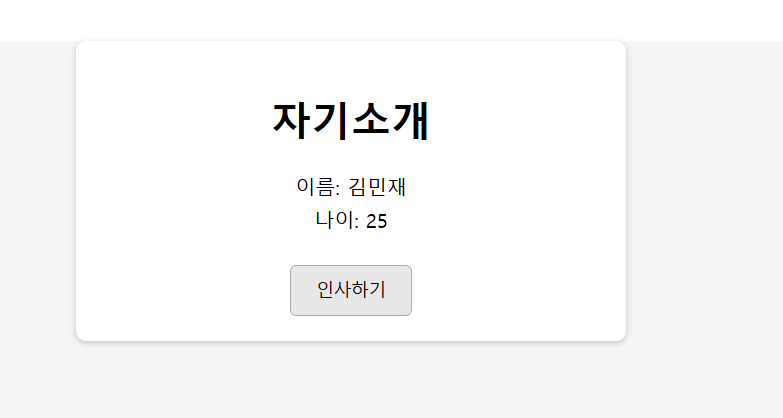
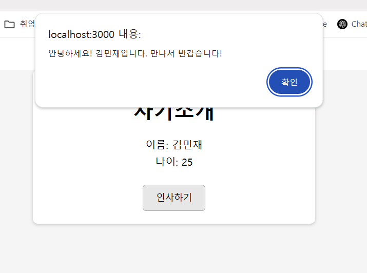

# 생성형 AI를 활용하여 자기소개 웹 페이지 만들기

-  HTML,CSS,JS로 구성된 웹 페이지를 제작합니다.
- React환경에서 렌더링이 되어야합니다.

## 페이지 안내

- 이름과 나이를 출력하는 간단한 자기소개 페이지입니다.
- 아래의 인사하기 버튼을 통해 팝업창이 출력되며 사전에 정의된 문장이 함께 출력되게 됩니다.

## 구성요소

- HTML5
- CSS
- js


## 소스코드 info.

### intro.jsx

```js
function MyIntro() {
  // 간단한 인삿말을 띄우는 함수
  const greet = () => {
    alert('안녕하세요! 김민재입니다. 만나서 반갑습니다!');
  };
```
#### Explanation.

1. 인사 버튼을 눌렸을 때 띄워질 인삿말을 생성합니다.
  
```js
// 전체 배경과 레이아웃을 위한 스타일
  const bodyStyle = {
    margin: 0,
    padding: 0,
    background: '#f5f5f5',
    minHeight: '100vh' // 화면 전체 높이
  };

  // 중앙 정렬을 위한 컨테이너 스타일
  const containerStyle = {
    maxWidth: '400px',
    margin: '50px auto',
    padding: '20px',
    background: '#fff',
    borderRadius: '8px',
    textAlign: 'center',
    boxShadow: '0 2px 5px rgba(0,0,0,0.2)'
  };

  // 정보 텍스트 스타일
  const infoStyle = {
    fontSize: '16px',
    margin: '5px 0'
  };

  // 버튼 스타일
  const buttonStyle = {
    marginTop: '20px',
    padding: '10px 20px',
    fontSize: '14px',
    cursor: 'pointer',
    border: '1px solid #aaa',
    borderRadius: '5px',
    background: '#e7e7e7'
  };
```
#### Explanation.


1. 스타일을 정의합니다
   - 전체 배경, 레이아웃
   - 중앙 정렬 컨테이너
   - 텍스트
   - 버튼


```js
return (
    // 최상단 div에 인라인 스타일 지정(실제로는 body에 적용하기 어려우니 최소 레이아웃 컨테이너로 사용)
    <div style={bodyStyle}>
      <div style={containerStyle}>
        <h1>자기소개</h1>
        <p style={infoStyle}>이름: 김민재</p>
        <p style={infoStyle}>나이: 25</p>
        <button style={buttonStyle} onClick={greet}>인사하기</button>
      </div>
    </div>
  );
```
#### Explanation.


1. 인라인 스타일을 지정하고 페이지에 출력될 내용을 정의합니다.
  

## 출력결과

<b>(웹 출력)</b>
<br></img><br/>

<b>(버튼 클릭시 웹 출력)</b>
<br></img><br/>
