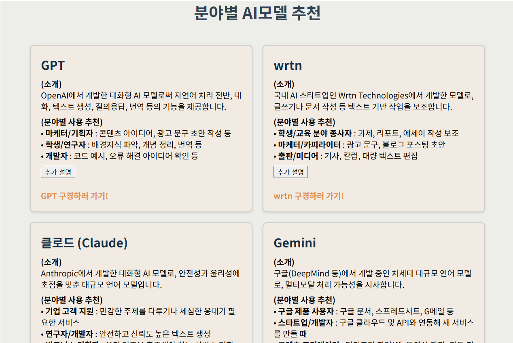
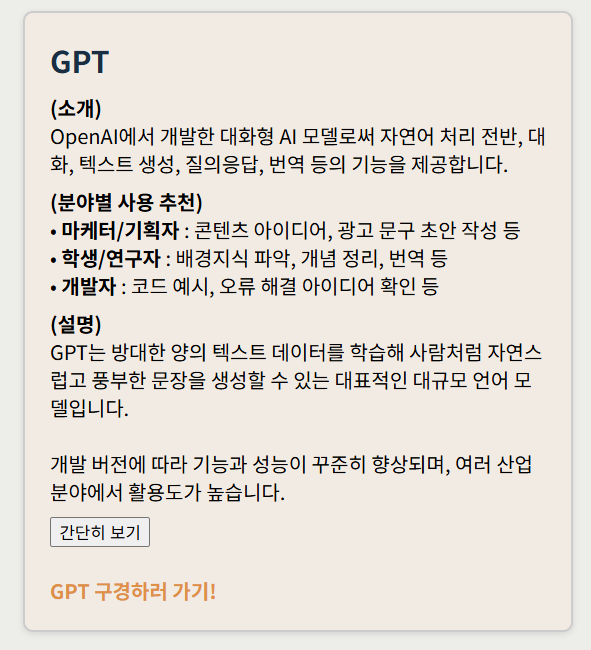

# 상황별 AI모델 추천 페이지 만들기

- 학생들 및 직장인 분들에게 상황에 맞는 AI모델을 소개해주고 링크를 통해 바로 작업으로 연결해줄 수 있는 페이지를 구현하였습니다.
- 3개의 Props와 6개의 State로 구성되어있는 React페이지입니다.

## 페이지 안내

- 6가지의 AI모델을 소개하고 간략한 설명과 어떤 상황에 사용하면 좋을지에 대한 정보를 제공합니다.
- 페이지를 구성하고 있는 AI의 종류는 아래와 같습니다.
    - GPT / wrtn / Claude / Gemini / Clova X / Perplexity
- "추가 설명"버튼을 통해 보다 상세한 모델의 정보를 확인하실 수 있습니다.
- "간단히 보기"버튼을 통해 설명을 간략화 할 수 있습니다.
- 각각의 설명 아래에 있는 "~구경하러 가기!"버튼을 통해 해당하는 AI 모델의 페이지로 이동합니다.

## 구성요소

- App.js
- index.js
- Area.jsx

## 소스코드 info.

### App.js

```js
import React from "react";
import Area from "./250408/Area"; 

function App() {
  return (
    <div style={{backgroundColor: "#edeeea"}}>
      <h1 style={{ textAlign: "center", color:" #2e4552" }}>분야별 AI모델 추천</h1>
      <Area 
        headingColor="#112f45"
        bgColor="#f4ebe2" 
        borderColor="#ccc" 
      /> {/*해당 위치에 Area의 내용이 들어갑니다. */}
    </div>
  );
}

export default App;
```
#### Explanation.

- Area.jsx 파일을 불러와 페이지를 구성합니다.
- 페이지의 제목을 설정합니다.
- Area.jsx에 전달할 3가지의 Props('headingColor', 'bgColor', 'borderColor')를 선언합니다.


### index.js
```js
import React from "react";
import ReactDOM from "react-dom/client";
import App from "./App"; 
// App.js가 src 폴더 바로 안에 있으므로 경로 "./App"

const root = ReactDOM.createRoot(document.getElementById("root"));
root.render(<App />);
```


### Area.jsx

```js
// 3개의 Props를 사용
const Area = ({ headingColor, bgColor, borderColor }) => {
  // 6개의 State (각 모델별 "추가 설명" 토글)
  const [showMoreGPT, setShowMoreGPT] = useState(false);
  const [showMoreWrtn, setShowMoreWrtn] = useState(false);
  const [showMoreClaude, setShowMoreClaude] = useState(false);
  const [showMoreGemini, setShowMoreGemini] = useState(false);
  const [showMoreClova, setShowMoreClova] = useState(false);
  const [showMorePerplexity, setShowMorePerplexity] = useState(false);
```
#### Explanation.

- 아래의 3가지의 Props를 전달받습니다.
  - headingColor
  - bgColor
  - borderColor
  
- 아래의 6가지 State를 선언합니다.
  - showMoreGPT
  - showMoreWrtn
  - showMoreClaude
  - showMoreGemini
  - showMoreClova
  - showMorePerplexity


```js
// 전달받은 Props를 활용해 스타일 지정
  const calloutStyle = {
    border: `2px solid ${borderColor}`,
    borderRadius: "8px",
    padding: "20px",
    backgroundColor: bgColor, // Probs로 받은 백그라운드 색상
    boxShadow: "0 2px 5px rgba(0,0,0,0.1)",
  };

  const headerStyle = {
    margin: "0 0 10px",
    color: headingColor, // Props로 받은 제목 색상
  };

  const paragraphStyle = {
    margin: "8px 0",
    lineHeight: "1.4",
  };

  const linkStyle = {
    color: "#ec8b33",
    textDecoration: "none",
    fontWeight: "bold",
  };
```
#### Explanation.

- 전달받은 Props를 활용하여 스타일을 지정합니다.
  - bgColor : 백그라운드 색상
  - headingColor : 제목 색상
  - borderColor : 테두리 선 색상


```js
<div style={containerStyle}>
        {/* 1) GPT 영역 */}
        <div style={calloutStyle}>
          <h2 style={headerStyle}>GPT</h2>
          <p style={paragraphStyle}>
            <strong>(소개)</strong>
            <br />
            OpenAI에서 개발한 대화형 AI 모델로써 자연어 처리 전반, 대화, 텍스트 생성,
            질의응답, 번역 등의 기능을 제공합니다.
          </p>
          <p style={paragraphStyle}>
            <strong>(분야별 사용 추천)</strong>
            <br />
            • <strong>마케터/기획자</strong> : 콘텐츠 아이디어, 광고 문구 초안 작성 등
            <br />
            • <strong>학생/연구자</strong> : 배경지식 파악, 개념 정리, 번역 등
            <br />
            • <strong>개발자</strong> : 코드 예시, 오류 해결 아이디어 확인 등
          </p>
          {showMoreGPT && (
            <p style={paragraphStyle}>
              <strong>(설명)</strong>
              <br />
              GPT는 방대한 양의 텍스트 데이터를 학습해 사람처럼 자연스럽고 풍부한 문장을
              생성할 수 있는 대표적인 대규모 언어 모델입니다.
              <br />
              <br />
              개발 버전에 따라 기능과 성능이 꾸준히 향상되며, 여러 산업 분야에서
              활용도가 높습니다.
            </p>
          )}
          <button onClick={() => setShowMoreGPT(!showMoreGPT)}>
            {showMoreGPT ? "간단히 보기" : "추가 설명"}
          </button>
          <br />
          <br />
          <a
            style={linkStyle}
            href="https://openai.com"
            target="_blank"
            rel="noopener noreferrer"
          >
            GPT 구경하러 가기!
          </a>
        </div>
```
#### Explanation.

- GPT AI 모델에 대한 정보를 제공합니다.
  - 소개 : 해당 모델의 전반적인 정보
  - 분야별 사용 추천 : 직군 및 상황별로 해당 모델이 제공해줄 수 있는 기능에 대한 정보
  - 추가설명 : 해당 모델의 보다 상세한 정보를 제공
 
- "GPT 구경하러 가기!"버튼을 통해 GPT 페이지로 이동합니다.


## 출력결과

<b>(웹 출력)</b>
<br></img><br/>

<b>('추가설명'클릭)</b>
<br></img><br/>
